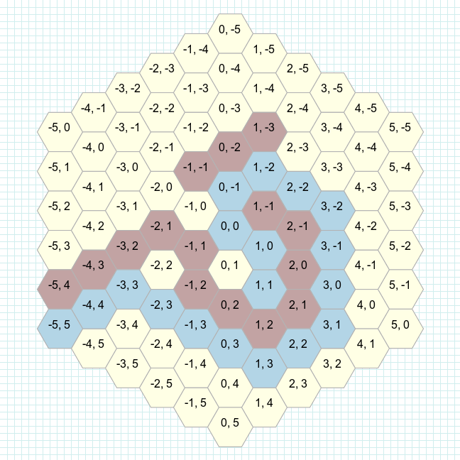
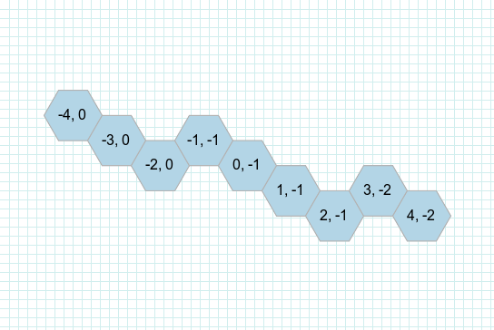
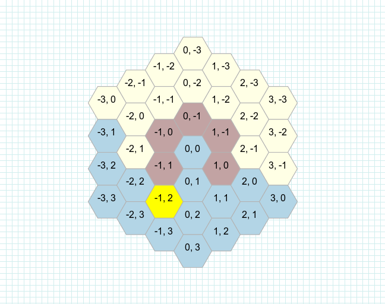
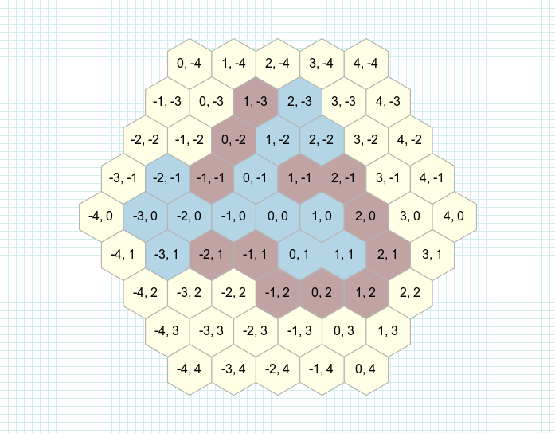

[](https://travis-ci.org/czuger/rhex)
[](https://badge.fury.io/rb/rhex)
[](https://codeclimate.com/github/czuger/rhex)
[](https://codeclimate.com/github/czuger/rhex/coverage)


# Rhex
This repository contain a library for using a grid of hexagons with ruby.

* It is a partial ruby implementation of the huge work of Amit Patel (http://www.redblobgames.com/grids/hexagons/).

## Compatibility

This gem has been tested with ruby 3.0.3

## Setup

```shell
gem install rhex -s https://github.com/mersen1/rhex
```

Or in your gemfile : 
```ruby
gem 'rhex', git: 'git@github.com:mersen1/rhex.git'
```

Then in your code :
```ruby
require 'rhex'
```

## Usage

### Basics

Create a new hexagon `q = 0, r = -2`.
</br>
To understand what `q` and `r` mean, please have a look at http://www.redblobgames.com/grids/hexagons/#coordinates

```ruby
hex = Rhex::AxialHex.new(0, -2)
# => #<Rhex::CubeHex @data=nil, @image_config=nil, @q=0, @r=-2, @s=2>
```

#### Neighbors
Returns array of hexagon "neighbors".
If a `grid` was provided, the neighbors will be searched within the grid.

```ruby
grid = Rhex::Grid.new([Rhex::AxialHex.new(0, 0), ...])
center = Rhex::AxialHex.new(0, -2)

center.neighbors(grid: grid)
# => [#<Rhex::CubeHex @q=1, @r=1, @s=-2>, #<Rhex::CubeHex @q=0, @r=1, @s=-1>, ...]
```

#### Distance
Get the distance between two hexagons.

```ruby
Rhex::AxialHex.new(0, 2).distance(Rhex::AxialHex.new(0, -2))
# => 4
```

#### Dijkstra shortest path

Finds the shortest path using the [Dijkstra algorithm](https://en.wikipedia.org/wiki/Dijkstra%27s_algorithm)

```ruby
obstacles = [Rhex::AxialHex.new(-1, 1), Rhex::AxialHex.new(-2, 1), ...]
source = Rhex::AxialHex.new(1, 1)
target = Rhex::AxialHex.new(-5, 5)

grid = Rhex::Grid.new
grid.add(source)

source.dijkstra_shortest_path(target, grid, obstacles: obstacles)
# => [#<Rhex::CubeHex @q=1, @r=1, @s=-2>, #<Rhex::CubeHex @q=1, @r=0, @s=-1>, ...]
```


#### Linedraw

Draws a line from one hex to another.

```ruby
source = Rhex::AxialHex.new(-4, 0)
target = Rhex::AxialHex.new(4, -2)

source.linedraw(target)
# => [#<Rhex::CubeHex @q=-4, @r=0, @s=4>, #<Rhex::CubeHex @q=-3, @r=0, @s=3>, ...]
```


#### Field of view

Returns visible location which is not blocked by obstacles.

```ruby
grid = Rhex::Grid.new
source = Rhex::AxialHex.new(-1, 2)
obstacles = [Rhex::AxialHex.new(-1, 1), Rhex::AxialHex.new(-1, 0), ...]

source.field_of_view(grid, obstacles)
# => [#<Rhex::CubeHex @q=0, @r=0, @s=0>, #<Rhex::CubeHex @q=0, @r=1, @s=-1>, ...]
```


#### Reachable

Returns array of all hexes that can be reached in `movements_limit` steps.

```ruby
movements_limit = 3
source = Rhex::AxialHex.new(0, 0)
obstacles = [Rhex::AxialHex.new(1, -1), Rhex::AxialHex.new(2, -1), ...]

source.reachable(movements_limit, obstacles: obstacles)
# => [#<Rhex::CubeHex @q=0, @r=0, @s=0>, #<Rhex::CubeHex @q=0, @r=1, @s=-1>, ...]
```


#### Ring

Returns array of all hexes which are take `radius` steps away from the center starting from `Rhex::CubeHex::INITIAL_RING_VECTOR`.

```ruby
ring = 2
center = Rhex::AxialHex.new(0, 0)

center.ring(ring)
# => [<Rhex::CubeHex @q=-2, @r=2, @s=0>, <Rhex::CubeHex @q=-1, @r=2, @s=-1>, ...]
```


