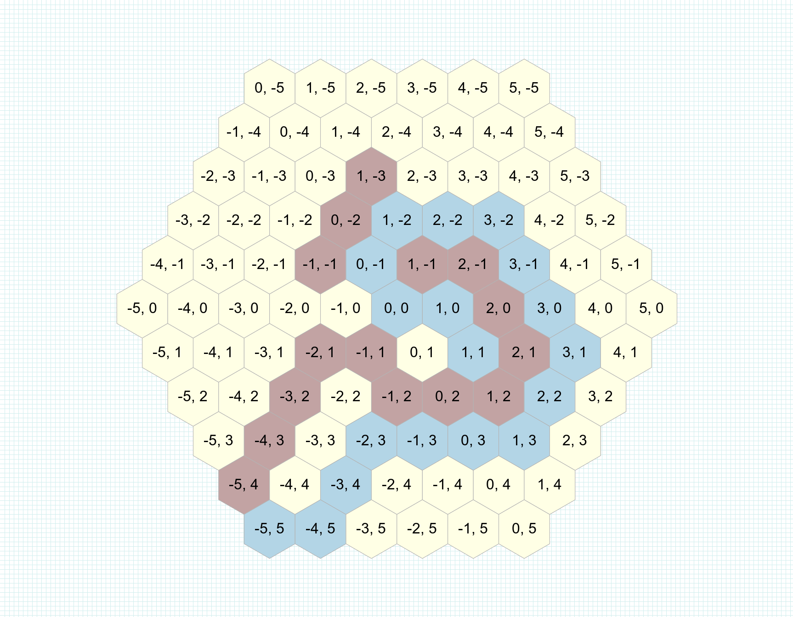

[](https://travis-ci.org/czuger/rhex)
[](https://badge.fury.io/rb/rhex)
[](https://codeclimate.com/github/czuger/rhex)
[](https://codeclimate.com/github/czuger/rhex/coverage)


# Rhex
This repository contain a library for using a grid of hexagons with ruby.

* It is a partial ruby implementation of the huge work of Amit Patel (http://www.redblobgames.com/grids/hexagons/).

## Compatibility

This gem has been tested with ruby 3.0.3

## Setup

```shell
gem install rhex -s https://github.com/mersen1/rhex
```

Or in your gemfile : 
```ruby
gem 'rhex', git: 'git@github.com:mersen1/rhex.git'
```

Then in your code :
```ruby
require 'rhex'
```

## Usage

### Basics

Create a new hexagon `q = 0, r = -2`.
</br>
To understand what `q` and `r` mean, please have a look at http://www.redblobgames.com/grids/hexagons/#coordinates

```ruby
hex = Rhex::AxialHex.new(0, -2)
# => #<Rhex::AxialHex @q=0, @r=-2, @data=nil>
```

#### Neighbors
Get neighbors (hexes surrounding it).

```ruby
Rhex::AxialHex.new(0, -2).neighbors
# => [#<Rhex::CubeHex @data=nil, @q=1, @r=-2, @s=1>, #<Rhex::CubeHex @data=nil, @q=1, @r=-3, @s=2>, ...]
```

#### Distance
Get distance between two hexagons

```ruby
Rhex::AxialHex.new(0, 2).distance(Rhex::AxialHex.new(0, -2))
# => 4
```

#### Reachable

Returns array of all hexes that can be reached in `movements_limit` steps.

```ruby
movements_limit = 4
Rhex::AxialHex.new(0, 0).reachable(movements_limit)
# => [#<Rhex::AxialHex @data=nil, @q=1, @r=0>, #<Rhex::AxialHex @data=nil, @q=0, @r=-1>, ...]
```

#### Dijkstra shortest path

Finds the shortest path using the [Dijkstra algorithm](https://en.wikipedia.org/wiki/Dijkstra%27s_algorithm)

```ruby
obstacles = [Rhex::AxialHex.new(-1, 1), Rhex::AxialHex.new(-2, 1), ...]
source = Rhex::AxialHex.new(1, 1)
target = Rhex::AxialHex.new(-5, 5)

grid = Rhex::Grid.new
grid.hset(source)

source.dijkstra_shortest_path(target, grid, obstacles: obstacles)
# => [#<Rhex::CubeHex @data=nil, @q=1, @r=1>, @s=-2>, #<Rhex::CubeHex @data=nil, @q=1, @r=0, @s=-1>, ...]
```


